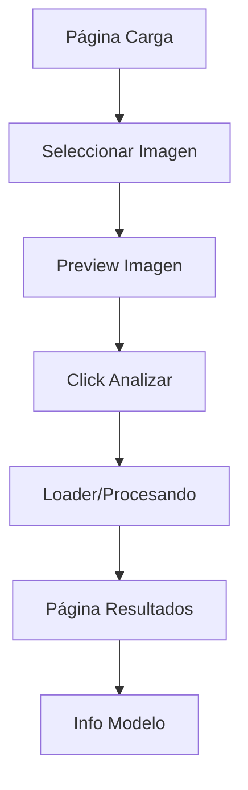

## 1. Product Overview
Sistema de detección y análisis de imágenes de rayos X para diagnóstico médico asistido por inteligencia artificial. Permite a profesionales de salud cargar radiografías torácicas y obtener predicciones sobre posibles condiciones pulmonares.

Diseñado para médicos radiólogos y personal de salud que necesitan una herramienta de apoyo para el diagnóstico rápido de patologías pulmonares mediante análisis automatizado de imágenes médicas.

## 2. Core Features

### 2.1 User Roles
| Role | Registration Method | Core Permissions |
|------|---------------------|------------------|
| Médico | Registro con credenciales médicas | Cargar imágenes, ver predicciones, acceder a información del modelo |
| Radiólogo | Verificación de especialidad | Acceso completo a predicciones, estadísticas y explicaciones clínicas |

### 2.2 Feature Module
Nuestro sistema de tamizaje por imágenes consiste en las siguientes páginas principales:
1. **Página de carga de imágenes**: área de arrastre, selector de archivos, preview de imagen.
2. **Página de resultados**: predicción con confianza, explicación clínica, recomendaciones.
3. **Página de información del modelo**: estadísticas, clases de predicción, métricas de rendimiento.

### 2.3 Page Details
| Page Name | Module Name | Feature description |
|-----------|-------------|---------------------|
| Carga de imágenes | Área de carga | Permite arrastrar o seleccionar archivos JPG/PNG, valida formato y tamaño de imagen |
| Carga de imágenes | Preview de imagen | Muestra la imagen cargada con opción de cambiar o eliminar antes del análisis |
| Carga de imágenes | Botón de análisis | Inicia el proceso de predicción, se deshabilita durante la ejecución |
| Carga de imágenes | Indicador de carga | Muestra spinner o barra de progreso mientras se procesa la imagen |
| Resultados | Predicción principal | Muestra la clase predicha (COVID19, NORMAL, PNEUMONIA, TUBERCULOSIS) con porcentaje de confianza |
| Resultados | Probabilidades | Lista todas las clases con sus respectivas probabilidades |
| Resultados | Explicación clínica | Proporciona contexto clínico y patrón radiológico observado |
| Resultados | Recomendaciones | Sugiere próximos pasos clínicos basados en la predicción |
| Información del modelo | Clases de predicción | Describe cada condición médica que el modelo puede detectar |
| Información del modelo | Estadísticas de rendimiento | Muestra precisión, recall y F1-score por clase |
| Información del modelo | Detalles técnicos | Información sobre arquitectura, framework y parámetros del modelo |

## 3. Core Process

### Flujo de Usuario Médico
1. El usuario accede a la página de carga de imágenes
2. Selecciona o arrastra una imagen de rayos X al área designada
3. La imagen se muestra en preview para confirmación
4. El usuario hace clic en "Analizar imagen"
5. Se muestra el loader mientras se procesa (deshabilitando el botón)
6. Se redirige a la página de resultados con la predicción
7. El usuario puede ver información detallada del modelo si lo desea

## 4. User Interface Design

### 4.1 Design Style
- **Colores primarios**: Azul médico (#2563eb) y blanco
- **Colores secundarios**: Verde para resultados normales (#10b981), rojo para alertas (#ef4444)
- **Estilo de botones**: Redondeados con sombra sutil, estado disabled con opacidad reducida
- **Tipografía**: Inter o Roboto, tamaños 14-16px para texto normal, 18-20px para títulos
- **Diseño de layout**: Basado en cards con sombras, navegación superior
- **Iconos**: Estilo outline de Lucide React, iconos médicos para secciones relevantes

### 4.2 Page Design Overview
| Page Name | Module Name | UI Elements |
|-----------|-------------|-------------|
| Carga de imágenes | Área de carga | Card central con borde punteado azul, icono de upload, texto "Arrastra o selecciona imagen" |
| Carga de imágenes | Preview | Imagen centrada con max-height 400px, overlay con botones de cambiar/eliminar |
| Carga de imágenes | Botón análisis | Botón primario azul, se deshabilita y muestra spinner durante carga |
| Resultados | Predicción principal | Card grande con color de fondo según clase (verde/amarillo/rojo), porcentaje prominente |
| Resultados | Probabilidades | Lista con barras de progreso para cada clase, ordenadas por probabilidad |
| Resultados | Explicación | Card con icono médico, texto clínico en formato de lista |
| Información del modelo | Estadísticas | Tabla con métricas, gráfico de barras para precisiones por clase |

### 4.3 Responsiveness
- Diseño desktop-first con adaptación mobile
- Breakpoints: 768px para tablets, 1024px para desktop
- En móviles: área de carga ocupará 100% del ancho, preview con scroll horizontal
- Touch optimizado con áreas de click mínimas de 44px

### 4.4 3D Scene Guidance
No aplica para este proyecto - interfaz 2D para visualización médica.