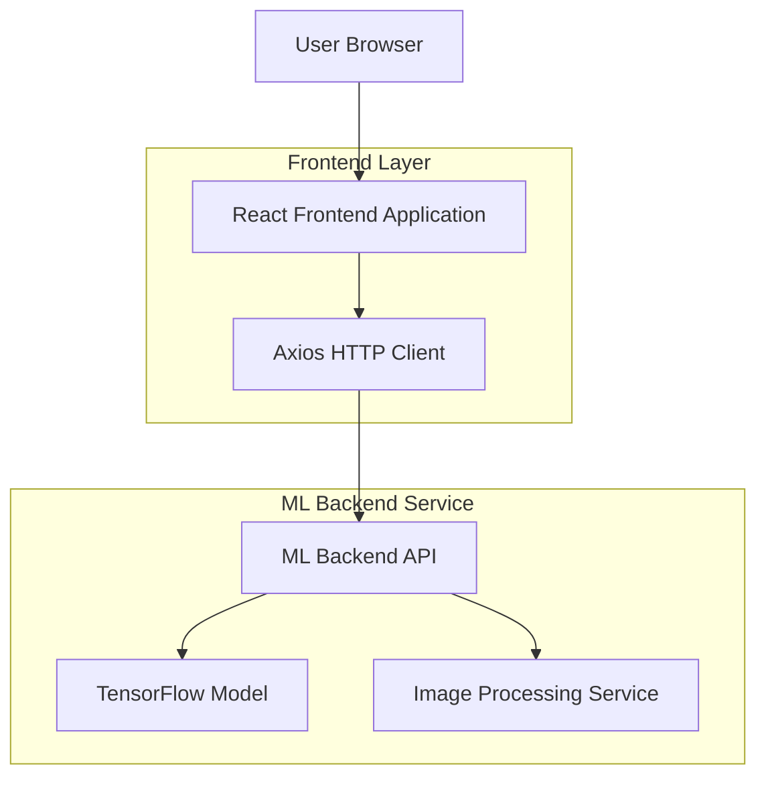
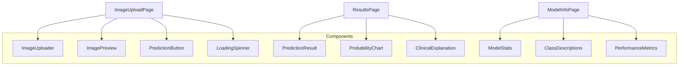

## 1. Architecture design



## 2. Technology Description

- Frontend: React@18 + tailwindcss@3 + vite
- Initialization Tool: vite-init
- HTTP Client: axios@1.6
- Backend: Servicio ML externo (FastAPI en localhost:8000)
- Gestión de estado: React Hooks (useState, useEffect)
- Librería de iconos: lucide-react

## 3. Route definitions

| Route | Purpose |
|-------|---------|
| /tamizajes-imagenes | Página principal de carga de imágenes |
| /tamizajes-imagenes/upload | Componente de carga y preview de imagen |
| /tamizajes-imagenes/resultados | Página de visualización de predicciones |
| /tamizajes-imagenes/modelo-info | Información técnica del modelo ML |

## 4. API definitions

### 4.1 Image Prediction API

```
POST /image/predict/explain
```

Request:
| Param Name| Param Type  | isRequired  | Description |
|-----------|-------------|-------------|-------------|
| file      | File        | true        | Imagen JPG/PNG de rayos X |

Response:
```json
{
  "predicted_class": "COVID19",
  "confidence": 0.9999823570251465,
  "interpretation": "Alta confianza - COVID19",
  "all_probabilities": {
    "COVID19": 0.9999823570251465,
    "NORMAL": 8.097584895949694e-7,
    "PNEUMONIA": 3.2320895115844905e-7,
    "TUBERCULOSIS": 0.000016494475858053192
  },
  "metadata": {
    "image_size": [332, 324],
    "processing_time_ms": 884.36,
    "filename": "COVID19(574).jpg"
  },
  "explicacion": {
    "contexto_clinico": "Patrón compatible con neumonía viral por COVID-19...",
    "recomendaciones": ["Solicitar prueba PCR..."],
    "consideraciones": ["Confianza alta en diagnóstico de COVID19"]
  }
}
```

### 4.2 Model Information API

```
GET /image/model/info
```

Response:
```json
{
  "model_type": "CNN - Convolutional Neural Network",
  "framework": "TensorFlow/Keras",
  "input_shape": [224, 224, 3],
  "num_classes": 4,
  "classes": ["COVID19", "NORMAL", "PNEUMONIA", "TUBERCULOSIS"],
  "architecture": {
    "total_params": 26216388,
    "trainable_params": 26213892,
    "layers": 20
  },
  "training_info": {
    "epochs": 50,
    "batch_size": 32,
    "optimizer": "Adam",
    "learning_rate": 0.0005,
    "loss": "categorical_crossentropy"
  }
}
```

### 4.3 Model Classes API

```
GET /image/model/classes
```

Response:
```json
[
  {
    "class_name": "COVID19",
    "description": "Neumonía viral causada por SARS-CoV-2..."
  },
  {
    "class_name": "NORMAL",
    "description": "Radiografía de tórax sin hallazgos patológicos..."
  }
]
```

### 4.4 Model Statistics API

```
GET /image/model/statistics
```

Response:
```json
{
  "test_accuracy": 0.92,
  "test_loss": 0.25,
  "per_class_metrics": {
    "COVID19": {
      "precision": 0.91,
      "recall": 0.93,
      "f1": 0.92
    }
  },
  "confusion_matrix": [[180, 5, 3, 2], [4, 210, 1, 3], [8, 2, 195, 5], [2, 1, 3, 164]]
}
```

## 5. Frontend Component Architecture



## 6. State Management

### 6.1 React State Structure
```typescript
interface PredictionState {
  image: File | null;
  imageUrl: string | null;
  isLoading: boolean;
  prediction: PredictionResponse | null;
  error: string | null;
}

interface ModelInfoState {
  modelInfo: ModelInfo | null;
  classes: ModelClass[] | null;
  statistics: ModelStatistics | null;
  isLoading: boolean;
  error: string | null;
}
```

### 6.2 API Service Layer
```typescript
class ImageAnalysisService {
  async predictImage(file: File): Promise<PredictionResponse> {
    const formData = new FormData();
    formData.append('file', file);
    return axios.post('http://localhost:8000/image/predict/explain', formData);
  }
  
  async getModelInfo(): Promise<ModelInfo> {
    return axios.get('http://localhost:8000/image/model/info');
  }
  
  async getModelClasses(): Promise<ModelClass[]> {
    return axios.get('http://localhost:8000/image/model/classes');
  }
  
  async getModelStatistics(): Promise<ModelStatistics> {
    return axios.get('http://localhost:8000/image/model/statistics');
  }
}
```